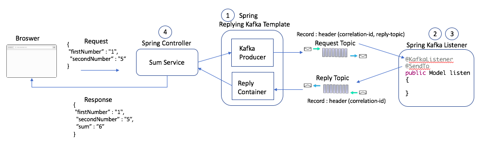

## Spring Kafka 同步請求-回應模式

本模組介紹如何使用 Spring Kafka 實現同步的請求-回應 (Request-Reply) 通訊模式。

### 核心概念

在典型的非同步消息傳遞中，發送方發送消息後不會等待回應。然而，在某些情境下，我們需要像傳統的同步呼叫一樣，發送請求並立即等待回應。Spring Kafka 提供了 `ReplyingKafkaTemplate` 來實現此同步模式。

運作方式如下：

1. **客戶端 (Client)**：使用 `ReplyingKafkaTemplate` 發送一則請求消息至指定的請求主題 (Request Topic)。該消息會包含一個特殊的標頭 (Header)，通常是 `KafkaHeaders.REPLY_TOPIC`，指定客戶端監聽回應的特定回覆主題 (Reply Topic)。
2. **等待回應**：客戶端在發送請求後會同步阻塞，等待來自指定回覆主題的回應消息。可以設定超時時間以避免無限期等待。
3. **服務端 (Server)**：使用 `@KafkaListener` 監聽請求主題。
4. **處理請求**：服務端接收到請求消息後，進行業務邏輯處理。
5. **發送回應**：服務端處理完成後，從請求消息的標頭中獲取回覆主題，並使用 `@SendTo` 或直接操作 KafkaTemplate 將回應消息發送至該回覆主題。
6. **客戶端接收回應**：客戶端從其指定的回覆主題接收到回應消息，解除阻塞，並將結果返回給呼叫者。

這種模式通常需要為每個客戶端實例配置一個唯一的回覆主題，以確保請求和回應能夠正確匹配。

### 相關範例與討論

- **範例專案**：
  - [vxavictor513/spring-kafka-request-reply](https://github.com/vxavictor513/spring-kafka-request-reply): 展示了使用 `ReplyingKafkaTemplate` 和 `AggregatingReplyingKafkaTemplate` 的範例。
  - [mudiadamz/spring-kafka-request-reply](https://github.com/mudiadamz/spring-kafka-request-reply): 提供了一個使用 `ReplyingKafkaTemplate` 進行同步請求-回應的簡單範例。
- **技術討論**：
  - [Stack Overflow: Spring boot Kafka request-reply scenario](https://stackoverflow.com/questions/64109796/spring-boot-kafka-request-reply-scenario): 討論了使用 `ReplyingKafkaTemplate` 相較於 Spring Cloud Stream 實現請求-回應模式的優劣。普遍認為 `ReplyingKafkaTemplate` 更直接適用於此場景。

### 其他相關文章

- [Synchronous Kafka: Using Spring Request-Reply](https://dzone.com/articles/synchronous-kafka-using-spring-request-reply-1)
- [Synchronous Communication With Apache Kafka Using ReplyingKafkaTemplate](https://www.baeldung.com/spring-kafka-request-reply-synchronous)
